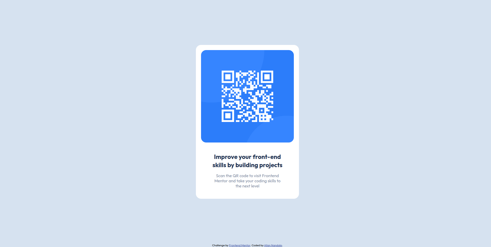

# Frontend Mentor - QR code component solution

This is a solution to the [QR code component challenge on Frontend Mentor](https://www.frontendmentor.io/challenges/qr-code-component-iux_sIO_H). Frontend Mentor challenges help you improve your coding skills by building realistic projects.

## Table of contents

- [Overview](#overview)
  - [Screenshot](#screenshot)
  - [Links](#links)
  - [My process](#my-process)
  - [Built with](#built-with)
  - [Continued development](#continued-development)
  - [Author](#author)

## Overview

After being away from the development world for a while. i decided i should go back to the basics and had to begin with this challenge.

### Screenshot

### Links

- Solution URL: [Add solution URL here](https://www.frontendmentor.io/solutions/qrcodecomponent-VuzbFcwc22)
- Live Site URL: [https://roaring-moonbeam-5808dc.netlify.app/](https://your-live-site-url.com)

## My process

- Read through the style guide.
- set up the html file.
- delete unneccesary content.
- create and link css files.
- solve the challenge.

### Built with

- Semantic HTML5 markup
- CSS custom properties
- Flexbox
- Mobile-first workflow

### Continued development

I want to be able to write css and sass proficiently

## Author

- Frontend Mentor - [@yourusername](https://www.frontendmentor.io/profile/Allanlcomander)
